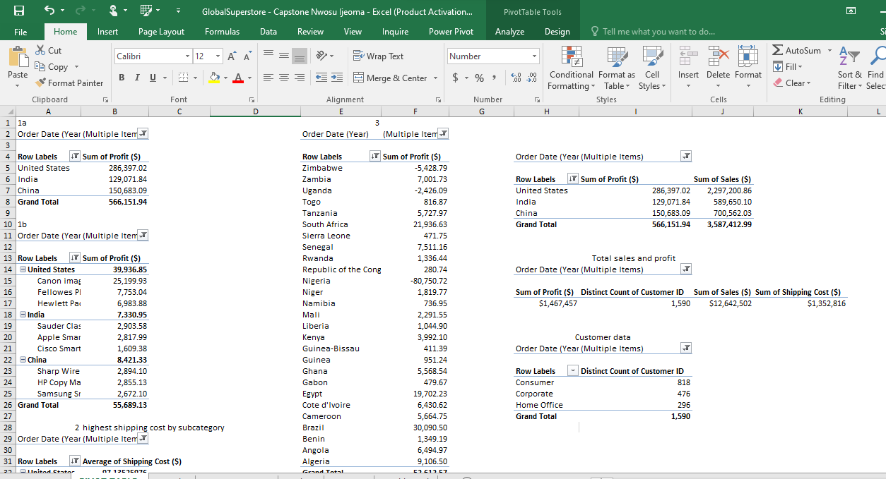

# Global Superstore Report by Ijeoma Nwosu

## Introduction
Global Superstore is a global online retailer based in New York, boasting a broad product catalog and aiming to be a one-stop-shop for its customers. Global The superstore’s clientele, hailing from 147 different countries, can browse through an endless offering with more than 10,000 products. This large selection comprises three main categories: office supplies (e.g., staples), furniture (e.g., chairs), and technology (e.g., smartphones). You are contracted as a Data Analyst to help Global Superstore analyze and draw out meaningful insight from the Superstore dataset which would aid management in making informed decisions to improve performance and profitability.

## Problem statement

**Question 1**
a) What are the three countries that generated the highest total profit for Global Superstore in 2014?
b) For each of these three countries, find the three products with the highest total profit. Specifically,what are the products’ names and the total profit for each product?

**Question 2**
a) Identify the 3 subcategories with the highest average shipping cost in the United States.

**Question 3**
a) Assess Nigeria’s profitability (i.e., total profit) for 2014. How does it compare to other African
countries?
b) What factors might be responsible for Nigeria’s poor performance? You might want to investigate
shipping costs and the average discount as potential root causes.

**Question 4**
a) Identify the product subcategory that is the least profitable in Southeast Asia.
Note: For this question, assume that Southeast Asia comprises Cambodia, Indonesia, Malaysia, Myanmar
(Burma), the Philippines, Singapore, Thailand, and Vietnam.
b) Is there a specific country i n Southeast Asia where Global Superstore should stop offering the
subcategory identified in 4a?

**Question 5**
a) Which city is the least profitable (in terms of average profit) in the United States? For this analysis,
discard the cities with less than 10 Orders. b) Why is this city’s average profit so low?

**Question 6**
a) Which product subcategory has the highest average profit in Australia?

**Question 7**
a)Who are the most valuable customers and what do they purchase?

## Data source
Find the the link to the Global superstore dataset in below:
https://docs.google.com/spreadsheets/d/1nxESpFzWjlGDMGDVLH69xmDzIl9l6OEq/edit#gid=633280281

## Skills demonstrated
- Power Query
  
  ---
- Data Cleaning
- Data Visualization
- Knowledge of generating actionable insights all using Microsoft Excel

## Visualization
The dashboard was created using power query, pivot tables and visualization tools

---

---

Findings
1. What are the three countries that generated the highest total profit for Global Superstore in 2014?
   
**United States	39,936.85**

-Canon imageCLASS 2200 Advanced Copier	25,199.93 

-Fellowes PB500 Electric Punch Plastic Comb Binding Machine with Manual Bind	7,753.04

-Hewlett Packard LaserJet 3310 Copier	6,983.88

**India	7,330.95**

-Sauder Classic Bookcase, Traditional	2,903.58

-Apple Smart Phone, with Caller ID	2,817.99

-Cisco Smart Phone, with Caller ID	1,609.38

**China	8,421.33**

-Sharp Wireless Fax, Digital	2,894.10

-HP Copy Machine, Color	2,855.13

-Samsung Smart Phone, VoIP	2,672.10

3. Identify the 3 subcategories with the highest average shipping cost in the United States.
   
**United States**

-Copiers	165.29

-Machines	132.24

-Tables	69.95

3 Factors responsible for Nigeria's poor performance amongst other African countries are:

a. Very high average discount

b. High shipping cost

4 The product sub-category with the least profitability in South-east Asia is **Accessories**

4b. Global superstore should stop offering accessories in **Indonesia**

5a. Burlington is the least profitable city in the United States

b. The average profit is very low due to high shipping cost and long shipping

6. the product subcategory with the highest average profit in Australia is **Appliances**
   
7. Who are the most valuable customers and what do they purchase?
   
### Australia	

**Appliances	5,599.58**

**David Philippe**

1. Breville Microwave, Silver	3,811.00
   
2. Cuisinart Refrigerator, Silver	1,788.59
   
**Phones	5,508.32**

**Craig Reiter**

1. Apple Speaker Phone, VoIP	333.15
   
2. Nokia Smart Phone, with Caller ID	5,175.17
   
**Bookcases	5,486.67**

**Maria Bertelson**

1. Sauder Classic Bookcase, Metal	5,486.67

